# User Guide

## Primeros Pasos

Esta guia intenta ilustrar los primeros pasos a seguir al registrarse en EasySpeak, desde la recepción del correo de alta, hasta el primer cambio de contraseña.

### Correo de Subscripción

Una vez que te hayas dado de alta en Toastmaster y el comité te haya dado de alta en Easy Speak, recibirás un correo para iniciar sesión.

Este correo vendrá de **do_not_reply@tmclub.eu** y tendrá el título **Bienvenido al Foro de Toastmasters Europe**.

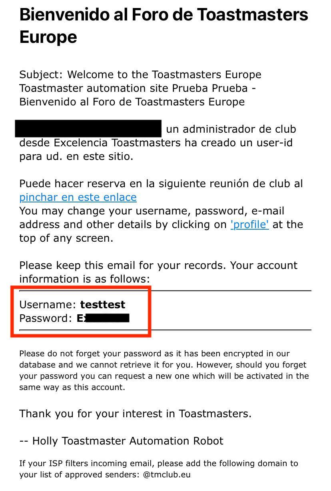

En este correo podrás ver un usuario y contraseña temporal para poder iniciar sesión en Easy Speak.

### Inicio de Sesión

Para iniciar sesión primero debes entrar en la página de [Easy Speak](https://tmclub.eu/portal.php).

En la barra de navegación debes hacer click al panel **Log In**.

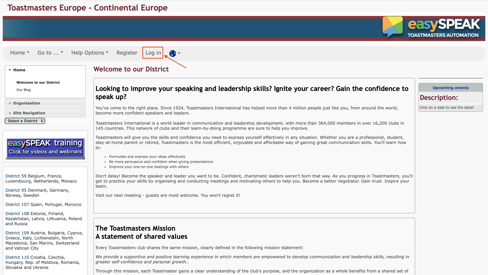

Esto te llevará a la página de **Inicio de Sesión**, donde deberás:

1. Meter el usuario y contraseña que te han asignado en el mail.

2. Hacer click en el botón **Log In**.

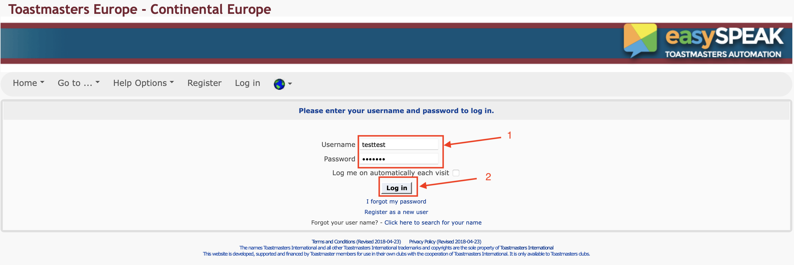

Hecho esto, habrás entrado a tu usuario de EasySpeak.

!!! warning "Cuidado"
    La primera vez que entras a EasySpeak, te pedirá renovar la contraseña. 

    No cierres sesión sin cambiar la contraseña o no podrás volver a entrar.

    En caso de que hayas cerrado sesión por error, contacta con el administrador de EasySpeak para que te haga reset a la contraseña.

### Renovar Contraseña

La primera vez que inicies sesión te aparecerá un mensaje diciendo que la contraseña ha expirado. Haz click en el enlace de la descripción para ir al formulario de renovar contraseña.

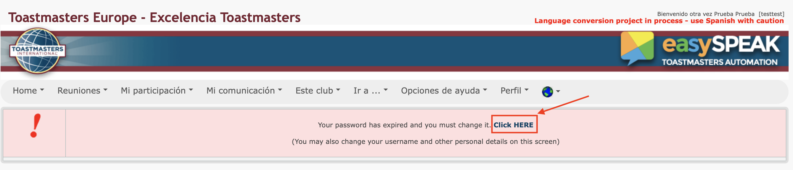

Una vez en el formulario realice los siguientes pasos:

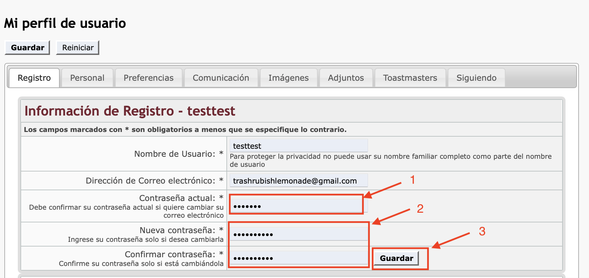

1. Introduce la contraseña del email en **Contraseña Actual**.

2. Introduce tu nueva contraseña en **Nueva Contraseña** y **Confirmar Contraseña**.

3. Haz click en el botón **Guardar**.

En este punto te aparecerá una ventana nueva diciendote que has modificado con éxito tu perfil. A partir de ahora deberás usar tu nueva contraseña.

## Funciones de EasySpeak

EasySpeak es una herramienta que intenta facilitar la gestión de reuniones de Toastmasters. Para ello, ofrece las siguientes funciones:

1. Visualización de la agenda de próximas reuniones

2. Escoger un rol para una sesión.

3. Pedir charlas.

### Visualización de Agenda

Para poder visualizar la agenda el primer paso es abrir el panel **Última Reunión**.

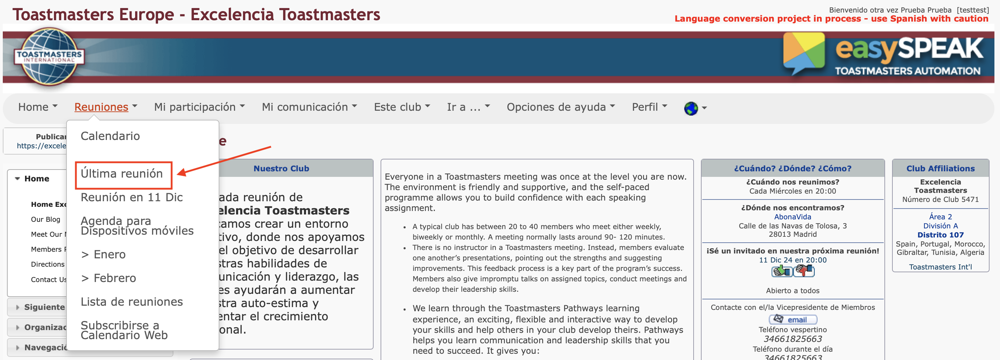

Esto te redirigirá a la agenda de la última reunión, donde podrás ver varias informaciones interesantes:

1. Información sobre la asistencia: Este menú es útil para ver quien va a asistir a la reunión y/o quien asistió a una reunión. Si planeas asistir a una reunión no dudes en marcar que asistirás, así el TM podrá contar contigo.
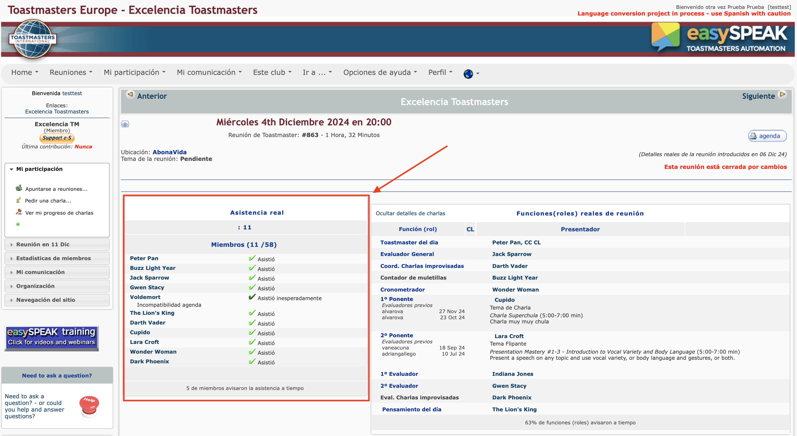

2. Información sobre los roles: Este menú es útil para ver que roles están cogidos, quien va a realizar cada rol, y en caso de que el rol esté libre podrás coger un rol, como veremos en la siguiente sección.
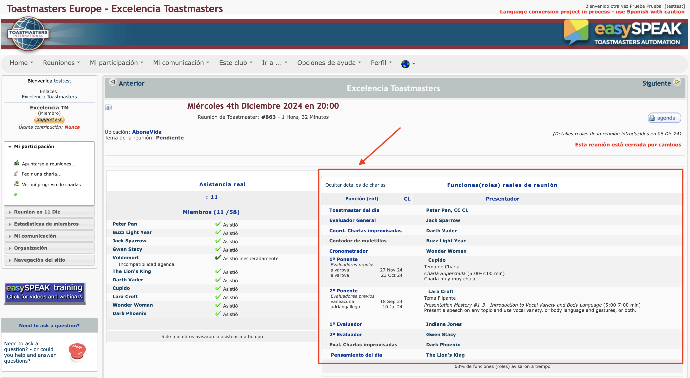

3. Agenda detallada: Haciendo click al botón **Agenda**, es posible ver la agenda detallada, con los tiempos de cada rol. Si vas a coger el rol de cronometrador, desde luego que te interesa echar un ojo a la agenda detallada para conocer los tiempos de cada rol.
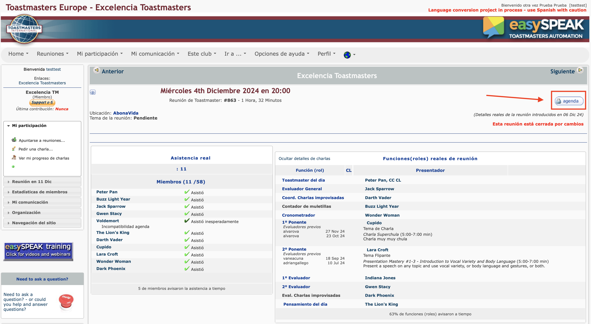

4. Navegar entre reuniones: Es posible navegar a reuniones anteriores o a reuniones futuras usando los botones **Anterior** y **Siguiente**.
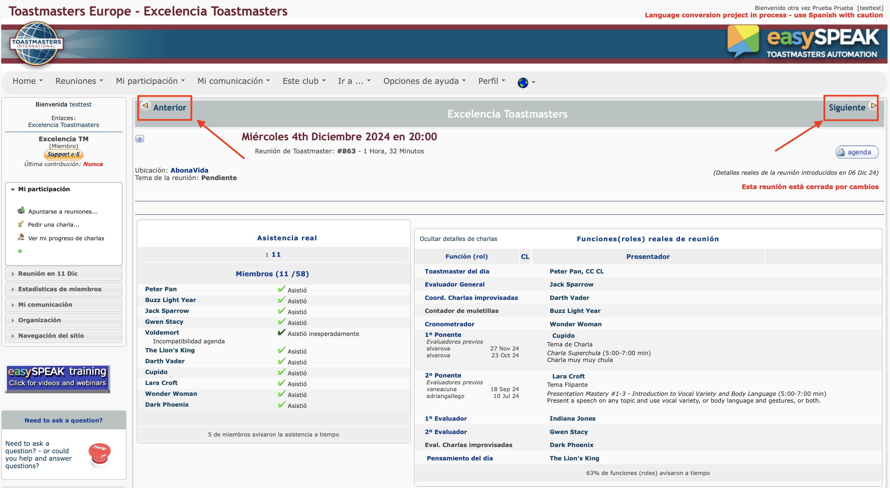

### Escoger Rol

Para asignarse un rol en EasySpeak hay varias formas de proceder:

1. Los roles basicos puedes asignartelos tu mismo desde EasySpeak, o en caso de experimentar problemas, pueden asignartelos el Toastmaster del día, o el VP de EasySpeak. Los roles básicos serian:

    1. Contador de muletillas

    2. Cronometrador

    3. Round Robin Master

    4. Cronista

    5. Coordinador de Improvisadas

    6. Evaluador

2. Las charlas preparadas solo pueden ser asignadas por el Toastmaster del día o por el VP de EasySpeak.

3. El rol de Toastmaster del día solo puede ser asignado por el VP de EasySpeak.

#### Asignar Rol Básico

En esta sección nos centraremos en el primer caso, como asignarse un rol básico usando EasySpeak. Lo primero será buscar la última reunión de EasySpeak, haciendo click al panel **Ultima Reunión**.

Después, habrá que usar el botón **Siguiente** para ir a una reunión que todavía no se haya llevado a cabo.

En esta nueva pantalla podremos hacer click para indicar si asistiremos o no a esta sesión. Esto es principalmente informativo, pero puede ser útil al Toastmaster del día para saber si puede contar contigo.

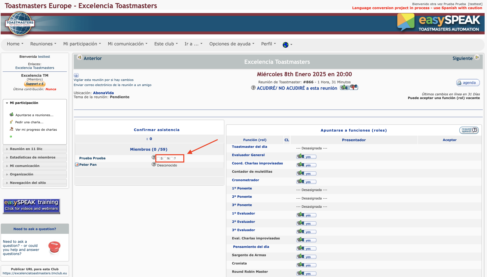

También es posible asignarse un rol a uno mismo haciendo click en el botón **Yes** situado junto al rol. Si teneis decidido tomar un rol no dudeis ni un momento en hacer click antes de que os lo quiten.

La única consideración a tener en cuenta es que antes de coger un rol de evaluador, debeis haber hecho al menos 4 charlas preparadas.

La captura siguiente muestra como asignarse el rol de **Contador de Muletillas**. El proceso es el mismo para los otros roles.

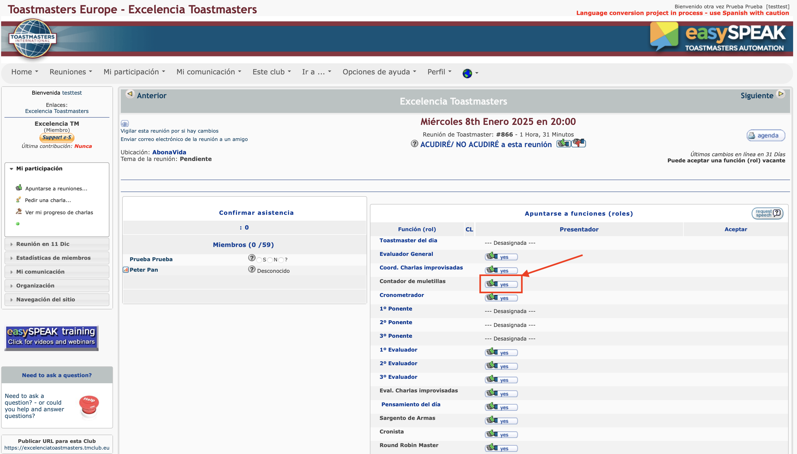

En caso de que no puedas asumir un rol que ya has aceptado, debes seguir dos pasos:

1. Notificar al Toastmaster del día

2. Cancelar el rol en EasySpeak, hacienco click en el botón del pulgar hacia abajo.

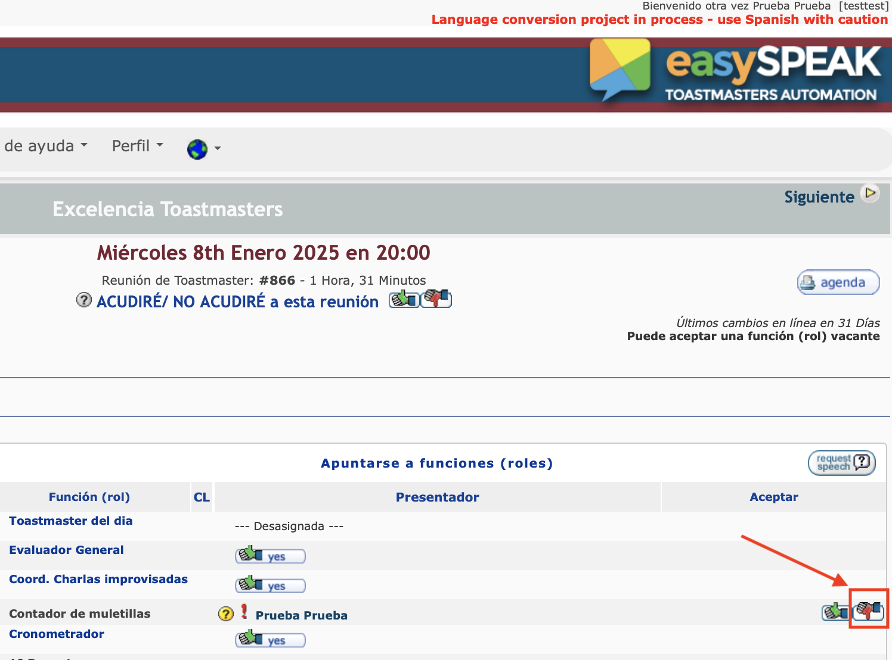

#### Asignación de Roles como Toastmaster

Cuando asumes el Rol de Toastmaster, el VP de EasySpeak te asignará el rol, y con ello tendrás algunos poderes y responsabilidades extra.

Como Toastmaster tu responsabilidad es llenar la agenda, y asegurarte de que todos los roles están cubiertos. Tu poder es que puedes asignar cualquier rol a los miembros del club, incluso tienes el poder de asignar charlas preparadas. 

¡Es tu sesión, tu te la guisas tu te la comes!

Si accedes a la agenda de una reunión en la que tu eres el Toastmaster, verás que la agenda está un poco cambiada:

Podrás marcar si alguien distinto de ti asistirá o no.

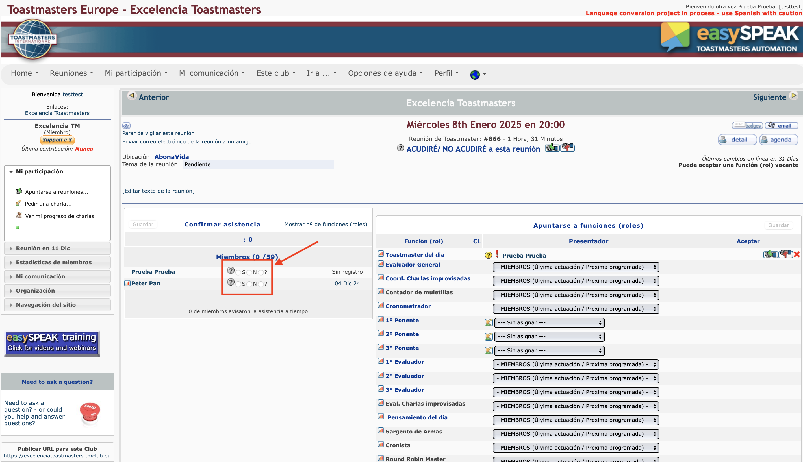

Podrás asignar roles a distintas personas, incluso charlas preparadas. No olvides dar al botón **Guardar** tras hacer cambios.

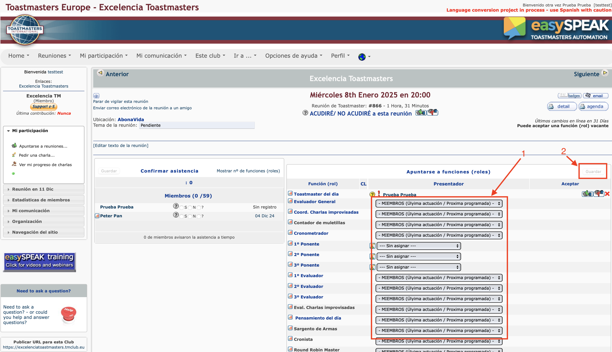

### Pedir una Charla

Para que el Toastmaster del día, o el VP de EasySpeak puedan asignarte una charla, debes rellenar el formulario para pedir una charla.

Primero haz click en el panel **Lista de Charlas**.

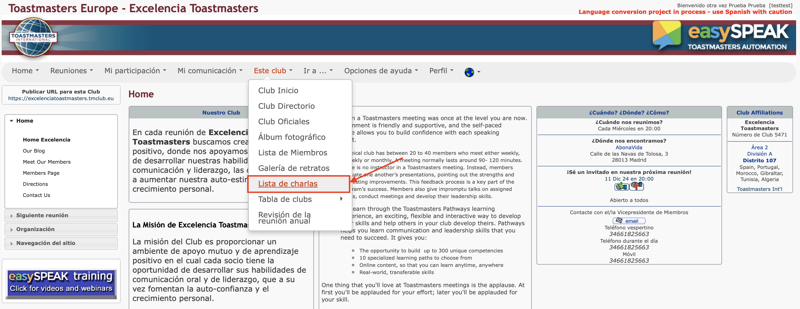

Luego haz click en el panel izquierdo donde pone **Pedir Charla**.

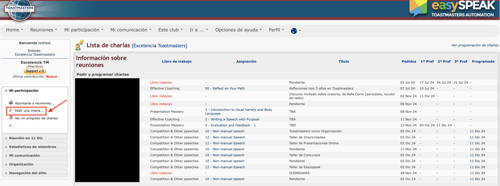

Se abrirá el formulario para pedir charla. Introduce un título y posteriormente haz click a **Libro de Trabajo/Charla**.

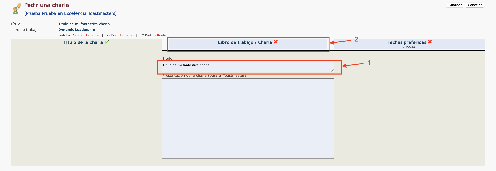

A continuación, introducimos el pathway que estamos realizando (solo la primera vez o si cambiamos pathways), seleccionamos nuestro nivel de pathways, y hacemos click en **Fechas Preferidas**.

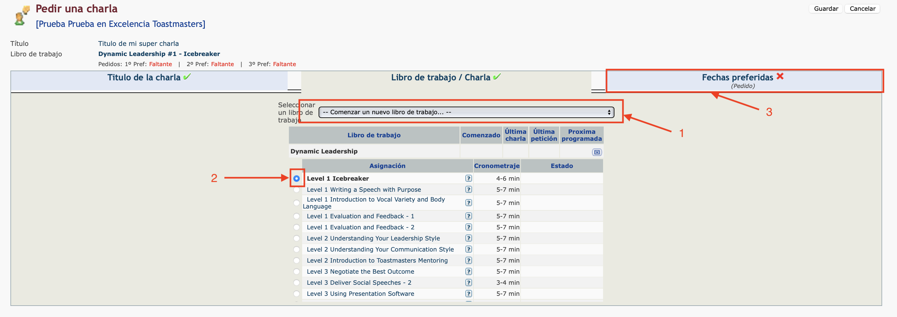

Seleccionamos nuestra fecha de preferencia, primera, segunda y tercera opción, y finalmente hacemos click en guardar para salvar la charla.

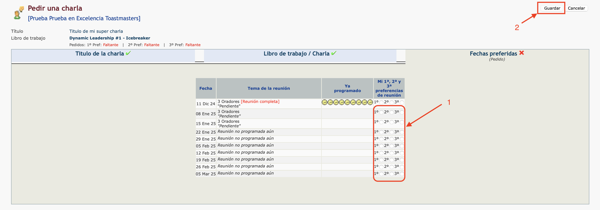

Felicidades! Has pedido con éxito una nueva charla.
